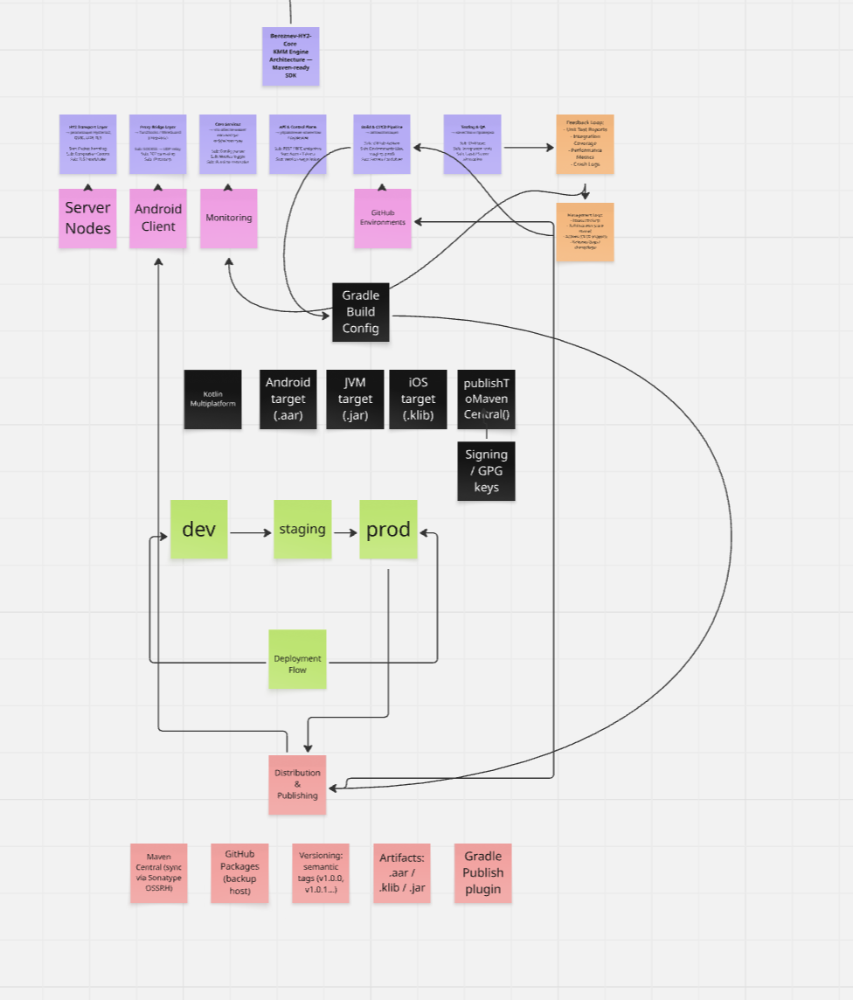
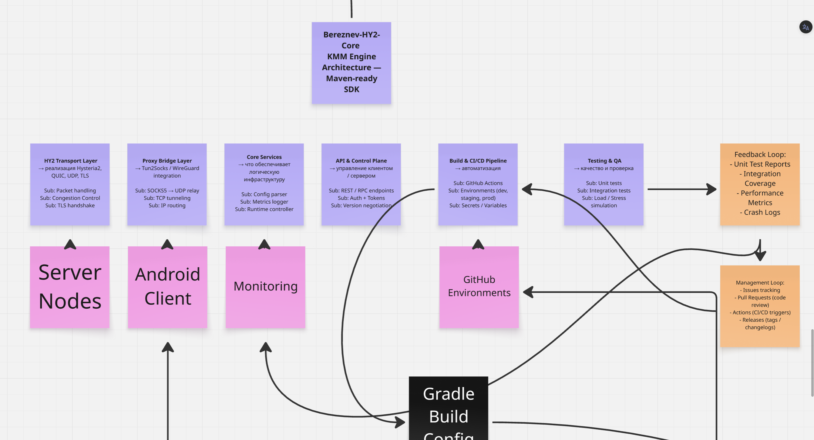

# Bereznev HY2 Core — SDK Architecture

**Version:** 1.0  
**Author:** Bereznev Tech  
**Type:** Kotlin Multiplatform Engine  
**Purpose:** Unified transport and SDK core for HY2 protocol (QUIC / UDP / TLS) with automated CI/CD and Maven publishing pipeline.

---

## 📊 System Overview

Bereznev-HY2-Core — это кроссплатформенное SDK-ядро (Kotlin Multiplatform), которое реализует:
- HY2 transport protocol (Hysteria2 / QUIC / UDP / TLS)
- Proxy bridge for SOCKS5 / WireGuard tunneling
- Configurable Core Services for runtime, metrics, and API control plane
- Full CI/CD pipeline (GitHub Actions, Environments, automated deployment)
- Multi-target builds (.aar / .jar / .klib) with Maven Central publishing

---

## 🧩 Architecture Map

> Визуальная схема ключевых слоёв SDK и их взаимосвязей:




*(изображение можно экспортировать из Miro как `architecture.png` и поместить в `/docs/`)*

---

## 💜 Core Layer

**Modules:**
- `HY2 Transport Layer` — реализация протокола Hysteria2, packet handling, congestion control  
- `Proxy Bridge Layer` — Tun2Socks / WireGuard integration, TCP tunneling  
- `Core Services` — config parser, metrics logger, runtime controller  
- `API & Control Plane` — REST / RPC endpoints, Auth + Tokens  
- `Testing & QA` — unit, integration, stress testing  

---

## 🌸 Integration Layer

**Components:**
- `Server Nodes` — HY2 nodes infrastructure (UDP relay)  
- `Android Client` — Kotlin Multiplatform consumer  
- `Monitoring` — runtime metrics, logs, performance dashboards  
- `GitHub Environments` — dev / staging / prod automation  

---

## ⚫ Build Layer

**Gradle Configuration:**
- Kotlin Multiplatform setup  
- Android target (.aar)  
- JVM target (.jar)  
- iOS target (.klib)  
- `publishToMavenCentral()`  
- `Signing / GPG keys`  

**Secrets & Tokens:**
- OSSRH token  
- GPG private key  
- GitHub PAT  

---

## 🟢 Deployment Flow

```text
dev → staging → prod
↑                ↓
   ←  feedback / rollback
```


---

Pipeline:
	•	Automated testing and integration
	•	Environment-based deployment
	•	Version tagging and changelog generation

---


🟥 Distribution & Publishing

Artifacts:
	•	.aar, .jar, .klib
	•	Versioning via semantic tags (v1.0.0, v1.0.1, …)
	•	Published via Gradle Publish Plugin

Repositories:
	•	Maven Central (Sonatype OSSRH sync)
	•	GitHub Packages (backup host)
	•	Optional Snapshots repository


---

🟠 Feedback & Management Loops
	•	Feedback Loop: Unit test reports, integration coverage, crash logs
	•	Management Loop: Issue tracking, pull request triggers, CI/CD automation
	•	Monitoring: Performance metrics & error aggregation


---

🧠 Summary

Bereznev-HY2-Core представляет собой самодостаточный SDK-движок, готовый для интеграции в:
	•	Android / JVM / iOS приложения (через Gradle dependencies)
	•	корпоративные системы VPN / Proxy / Network-tools
	•	гибкие CI/CD сценарии (GitHub Actions, automated publishing)


---


© Bereznev Tech — 2025